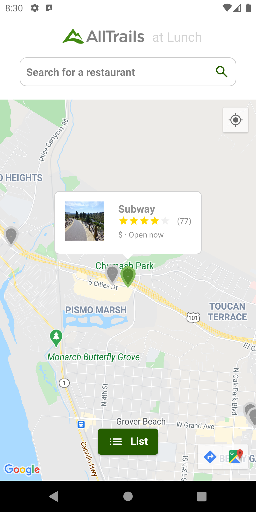
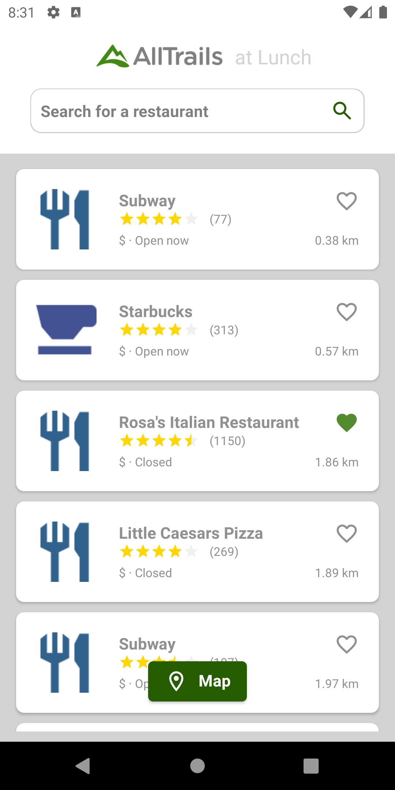

# AllFood

## Functionality

An app that shows a list of restaurants nearby and enables the user to mark the place as favorite.

## Structure:
Some os the components used are:

- MVVM Architecture.
- Koin - for dependency injection.
- Coroutines - for asynchronous programming on Android, as network calls and access to database.
- Retrofit - for the network calls.
- Gson - for the deserialization.
- Glide - for image loading and cache.
- RecyclerView - for displaying list of restaurants.
- GoogleMaps - to show the restaurants on the map.
- GoogleMapsApi - for getting the list of restaurants.
- ConstraintLayout - for the layout design.
- CardView - for the layout design.
- Room - for the database that saves the favorites place id and name.

## Views:
For the view it is using one Activity, which is hosting two fragments (MapFragment and ListFragment).
- MapFragment : 

It is displaying a map with the restaurants nearby and enables the navigation on the Google maps app.
 
 

- ListFragment : 

It is displaying a list with the restaurants nearby and enables the user to mark the place as favorite.
 
 

## Run the app:

No update is necessary, you can just clone the project and run it.

